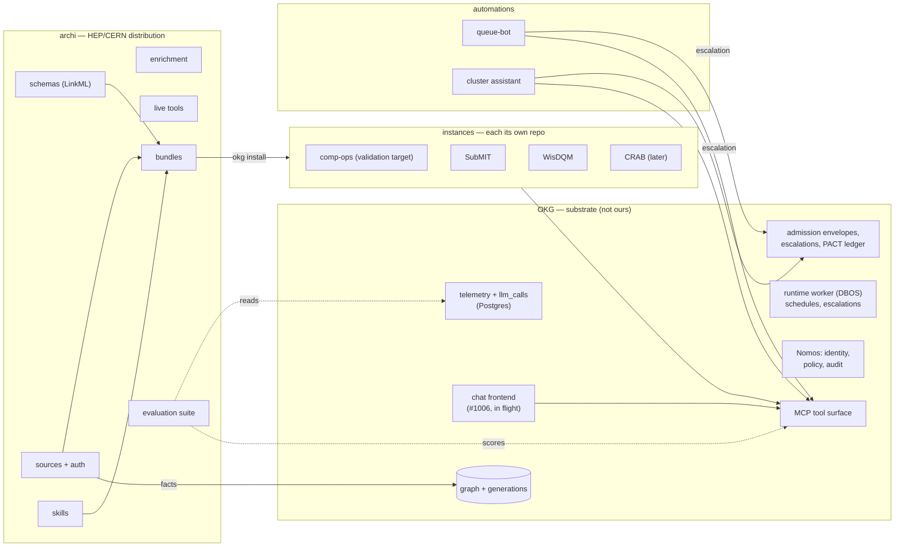

# Archi v3 — Program Spec, v2

**Audience:** an AI coding agent working in `archi-physics/archi`, plus the humans reviewing it.
**Status:** draft for discussion, revised after maintainer feedback (cooper deferred; bundle model reshaped; comp-ops named the standing validation target).
**Supersedes:** `archi-v3-transition-spec.md` (v1) and incorporates `archi_v3_review.md` plus a code audit of the repositories (§0).
**Branch:** all Archi work lands on **`archi_v3`**, branched from `main`. **Never commit to `main`** — it serves existing v2 deployments untouched until the cutover in §14. OKG-side testing may target the #1006 branch where needed; OKG `dev`/`main` are not ours to write.
**Change management:** PACT (OKG's evidence-gated change workflow), adopted in W0.

---

## 0. Provenance — what this spec is based on

The v1 spec was written without access to OKG and guessed at its interfaces. The review corrected the strategy but was written same-day against a moving target. This version is grounded in a file-level audit:

| Repo | Ref audited | State | Caveats |
|---|---|---|---|
| `archi-physics/archi` | `main` @ `9c9e1cb0`, `dev` @ `28b977d1` | matches review pins exactly | `main` and `dev` have **diverged** (82 vs 87 commits); see §0.1 |
| `mitdbg/okg` | `dev` @ `21c5b8c3e` (2026-08-11) | 48 commits past the review's pin (same day) | high velocity; re-verify interfaces at each work package |
| `mitdbg/okg-deployments` | `main` @ `f33a9c4` (2026-07-20) | review's pin `cae5d84` not present in this clone — reconcile | `cms` and `submit-cluster` both self-declare `lifecycle: blocked` |
| `archi-physics/cooper` | stale clone @ `22b2855` (2026-05-21) | **deferred** — cooper is out of scope for the first draft of v3 | audited findings kept on file for when it returns |

When an interface has drifted at implementation time: **stop and record, do not guess** (invariant 9). OKG's freshness checks cover *its own* surfaces and data watermarks; there is no external-interface diff check — pin-and-re-audit is manual discipline.

### 0.1 Audit findings that change the plan

1. **Archi's `origin/dev` holds the current scraper design.** A complete Scrapy rewrite (CERN SSO auth provider, TWiki crawl contracts, Discourse spider, scraper-level anonymization, `sources.web` config replacing `sources.links`) lives only on `dev`. Any source consolidation referencing `main`'s scrapers extracts the superseded implementation.
2. **The CMS deployment is bigger than the review said**: 27 registered sources, 22 adapter classes (9,328 LOC) in `cms/cms_sources/`, plus a `code_repos` block expanding 16 repos × 4 lanes into 64 generated source blocks. A **machine-checkable Archi↔OKG parity contract already exists** (`cms/docs/a2rchi-strict-source-parity.yaml` + `audit_a2rchi_source_parity.py` + `build_archi_parity_snapshot.py`).
3. **okg #1006 is confirmed unlanded**: open, conflicted, 280 files / +91,623 lines, 22 of 75 child tasks closed. Nothing from it — SSO, principal mapping, MCP HTTP auth, Open WebUI — is on `dev`. This work is in progress by the team and expected to land; until it does, development against the PR branch is the sanctioned path for chat-adjacent work (W9).
4. **"Schemas outside OKG's tree" splits into two facts.** Deployment-scoped schemas and bridge narrowings **already work out of tree today**. Only reusable **ontology modules** are locked in-tree (`load_modules_root()` hard-returns the package path; no `OKG_MODULES_ROOT`). The fix is small; the profiles system already ships the external-resolution cascade to copy.
5. **External source adapters already work** (YAML registry + `importlib`; deployment-local packages are the proven path). A pip-installed package should work identically but is unproven — proving it is W1, the keystone.
6. **OKG's review machinery is three systems, not one**: admission envelopes, escalations (with `timeout_at`, `decided_by`, timeout sweep), and the PACT decision ledger. Together they cover roughly two-thirds of v1's gate design. Genuine gaps: expiry on admission envelopes, approve-with-edits anywhere, per-**actor** cost caps, a true kill switch, and an authenticated, mounted HTTP API for opening a proposal from outside.
7. **Telemetry lives in OKG's Postgres** (`telemetry_*`, `mcp_call_log`, `llm_calls` with `cost_usd`); there is no wired OTLP export path. Per-call metering exists; per-user attribution does not.
8. *(Deferred with cooper.)* Cooper's absorbable assets — the physics ontology, document schemas, and LaTeX ingestion trio — are real but out of scope for the first draft.
9. **The v1 spec's Archi inventory is trustworthy** — all eleven LOC baselines reproduce exactly; the review's file-path corrections are confirmed. The "benchmark service" is `src/bin/service_benchmark.py` (636 LOC, Ragas) + `generate_benchmark_report.py` (525). The cluster-agent approval flow **does not exist in the archi repo** — it is external.
10. **A SubMIT integration point already exists**: `submit-cluster/live_capabilities.yaml` declares four live capabilities under **`role: a2rchi`** with an SSH `secret_ref`, governed by Nomos (`live_call_default: review`).
11. **Dormancy is structural**: `cms` reports freeze at 2026-05-07, no data caches are committed, registry drift exists. We inherit working code, not a running service — and some rot.
12. *(Noted for later; cooper deferred.)* Cooper's executed AN-vs-OKG A/B recorded the graph arm losing to a raw-note baseline. Kept only as the origin of a general practice: retrieval benchmarks keep a raw-document baseline arm where practical (W5).

---

## 1. Read this first

**What happened.** Archi v2 tried to be one product: retrieval, an agent runtime, a provider abstraction, a chat UI, four bot services, and a deployment CLI. Retrieval moved out to OKG. The v1 spec answered "what is Archi for?" with a HEP domain layer plus a home-built automation substrate. The review's correction, which the audit confirms: **most of that substrate already exists in OKG, is in flight there, or belongs there**. What OKG genuinely lacks, Archi files as requirements — it does not build around.

**What Archi becomes.** The **HEP/CERN distribution of OKG**: the schemas that say what a dataset, run, or ticket *is*; the sources that pull CERN systems into the graph; the enrichment that links records; the skills that instruct agents; the evaluation suite; and the bundles that turn a blank OKG install into a working instance. Archi holds no credentials, no site configuration, and no running services.

**What gets given away**: the agent loop to frameworks; the chat UI to OKG's Open WebUI integration; the provider abstraction to OKG's LLM layer; identity to Nomos; approval to OKG's admission/escalation/PACT systems; retrieval already gone. Roughly 20,000 lines of v2 are deleted rather than migrated, and that is the point.

**The bets, restated.**
1. **The OKG dependencies land.** Precisely (§7): the #1006 slices — MCP HTTP auth, per-user identity, the Open WebUI chat — plus two smaller items: external ontology-module resolution and the external review-API gaps. The chat/identity work is already in progress by the team, so this is a scheduling dependency, not a passive external bet; W9 develops against the #1006 branch in the meantime.
2. **The bundles are wanted beyond one team.** Addressed head-on by making the first bundle the *generic CERN* one (§9 W6) — TWiki, Indico, websites/docs, code — whose audience is every small CERN team, rather than leading with team-specific bundles.
3. **The dormant CMS deployment code revives cheaply.** W1/W2 test this within weeks, against the comp-ops instance, which is the standing validation target for the entire program.

**Where to start.** Two things. First, the fieldwork v1 demanded and nobody has done: **which v2 deployments are live, and who runs each** (the deprecation date is set after this inventory, never before). Second, W1 — prove the seam: a pip-installed Archi package serving one source and one schema into a scratch OKG instance, end to end.

---

## 2. The three layers, and the words for things

### 2.1 Layers

**OKG** is the substrate: the knowledge graph (generation-pinned reads), the ingestion runner, the MCP tool surface (`search`, `expand`, `inspect`, `filter`, `map`, `aggregate`, bounded `query`), identity and policy (Nomos), the three review systems, telemetry and cost metering, the runtime worker (DBOS), the installer, deployment lint, PACT, and — once #1006 lands — the chat frontend. Nothing HEP-specific.

**Archi** is the HEP/CERN distribution of OKG: one repository, one pip package, shipping schemas, sources, enrichers, live tools, skills, bundles, and the evaluation suite.

**Instances** (deployments) are running systems — comp-ops, SubMIT, WisDQM, CRAB. **Each has its own repo** (today: directories in `okg-deployments`; standalone repos are equally supported — see §6.3). An instance holds its configuration, secrets (by reference), site-specific sources, and operational content. Instances never live in Archi.

**A bundle is not an instance.** A bundle is a *starting selection plus defaults* — the thing that makes `okg install --profile <bundle>` produce a working instance in one command. The moment the instance exists, it owns its registry outright and diverges freely; instances never sync back to a bundle. Bundles exist per **recurring shape**, under the same second-call-site rule as everything else — not one per deployment (that would just be the deployment's config in the wrong repo). Distro analogy: Archi is the distro and package repository; a bundle is a spin; an instance is your installed machine; a source is a package any machine installs.

### 2.2 Terminology

| Term | Meaning |
|---|---|
| **OKG** | The substrate (self-describes as AKMON; we say OKG). |
| **Archi** | The HEP/CERN distribution of OKG: the repo and pip package. |
| **Source** | Code that pulls one external system into the graph (OKG's `SourceAdapter` protocol). Replaces: ingestor, scraper, collector, connector — OKG reserves *connector* for credentialed routed apps. |
| **Skill** | A reviewed instruction file served to agents (`SKILL.md` format). Replaces: playbook — OKG's mechanisms are named skills end to end (`skills_dir`, `skill_triggers`, `skill_bundle_hash`). Personal per-user prompts are **not** skills; the chat frontend owns those and Archi does no work for them. |
| **Bundle** | A packaged starting selection (schemas, source defaults, skills, init questions), implemented as an OKG install profile — which already resolves outside OKG's tree (`OKG_PROFILES_DIR` cascade). We say *bundle* because *profile* is overloaded in OKG. |
| **Instance** | A running deployment created from a bundle (or scaffolded bare). OKG calls this a "deployment". |
| **PACT** | OKG's change-proposal workflow; completion gated on recorded evidence. Replaces OpenSpec. |
| **Generation** | A published, pinned snapshot of the graph readers hold for a session. |

---

## 3. What Archi is — and is not

Archi ships, in one repo and one pip package:

1. **Schemas** — LinkML: operations (from the CMS deployment's 22 node classes + narrowings) and the bridges. (Physics/document schemas return with cooper, later.)
2. **Sources** — the consolidated CERN/HEP source package (§9 W2): TWiki, Indico, doc sites/websites, code repos, JIRA, CRIC, DBS, DQM, CMSSW releases, CondDB, WMStats, SITECONF, GOCDB, MONIT, HyperNews, Redmine.
3. **Auth plumbing** — CERN SSO cookie flows, X509/preflight probes, token handling (code only; credentials are instance property).
4. **Enrichment** — identifier extraction/linking (site names, dataset paths, run numbers, releases, global tags), reference rollups, anonymization.
5. **Live tools** — agent tools that query systems directly, outside the graph (e.g. the four `cms_monit_*` tools).
6. **Skills** — domain and operations instruction files (starting from the CMS deployment's 18).
7. **Bundles** — starting with one: `cern-team` (§9 W6).
8. **The evaluation suite** (§9 W5).

### Non-goals (each with where it went)

- **No agent runtime.** Frameworks own the loop; the runtime lessons are an ADR (Appendix B), not code.
- **No chat UI.** OKG's Open WebUI integration (#1006). Archi ships chat *configuration* per bundle: branding, default instructions, exposed tools.
- **No provider abstraction.** OKG's LLM layer. The 91-LOC CERN gateway provider becomes gateway configuration + docs.
- **No approval service.** OKG's admission envelopes, escalations, Nomos. Gaps filed as requirements (§7).
- **No identity or accounts.** Nomos — which already carries CERN claim vocabulary (`cern_person_id`, `cern_roles`, …) and `touchstone_oidc`.
- **No retrieval, vectorstore, embeddings.** OKG.
- **No Archi-owned MCP servers, and no repo-per-MCP-server.** Each *instance* runs OKG's MCP server (`okg mcp-serve` / the instance's `server.py`); the graph tools come with it for free. Archi's live tools are ordinary Python modules in the package that an instance's `deployment.yaml` declares — they ride the instance's server (§5.6). Zero new repos, zero new servers.
- **No shared business logic between automations, and no Archi SDK.** Automations use OKG's deployment SDK (`llm_call`, `request_escalation`, `cost_budget`, DBOS workflows) or raw MCP/HTTP.
- **No credentials, site config, or running services in Archi.** Instance property, by reference only.
- **No playbook service — but playbooks are *not* silently "replaced by skills".** v2 playbooks were two populations with different destinations. Shared/curated packs become **skills**: git-reviewed, hash-pinned, no agent write path — strictly better on the injection concern, which stays a standing invariant. Personal per-user packs and `/name` chat invocation become the **chat frontend's per-user prompts** (Open WebUI ships user-owned prompt presets with slash commands; W9 verifies they cover the use case and files a chat-frontend request if not). What is deleted without replacement — listed as accepted losses in W9, not hidden: the DB-backed per-user enablement of shared packs, the invocation-analytics tables, and the agent tools that drafted playbooks from conversation.

---

## 4. Decisions

Statuses: **Decided**, **Dependent** (waits on a named event), **Research** (someone must go find out).

### Decided

**D1. Archi is a distribution over OKG** — consolidation, not construction: absorb the CMS deployment's sources and schemas as starting material. (Cooper's assets return later.)

**D2. Chat is OKG's Open WebUI integration; LibreChat is dropped.** Archi ships chat configuration per bundle. The integration is in-flight (#1006); W9 may develop and test against the PR branch; production instances wait for landed slices.

**D3. No separate approval service.** Automations use `request_escalation()` and admission envelopes; remaining needs are filed upstream (§7). Decisions are recorded in OKG's ledgers; **execution stays in the automation that proposed** (v1's "the gate never executes", in substrate form).

**D4. Identity comes from Nomos.** Archi ships identity *setup* per bundle (CERN OIDC claims; Touchstone for SubMIT), never its own accounts. The authenticated multi-user session layer is #1006 work.

**D5. PACT replaces OpenSpec.** Archi's `openspec/` contains zero proposals — adopt clean via `okg pact install`; the decision ledger needs a reachable Postgres.

**D6. Terminology per §2.2** (source, skill — both amendments forced by the audit).

**D7. Schemas start deployment-scoped in bundles** (works today), promoted to shared ontology modules when OKG's external-modules change lands. LinkML YAML preserves v1's "declarative data, never Python classes" constraint; relocation stays a move, not a rewrite.

**D8. Traces and cost live in OKG's Postgres.** The v1 OTel-collector architecture is superseded. The evaluation suite reads `okg.llm_calls`, `okg.v_mcp_calls`, and the telemetry tables. Chat transcripts will live in the chat frontend's own database; the #1006 transcript source is the planned join path (tracked in W5).

**D9. Cooper is deferred wholesale.** No porting of its ontology, LaTeX ingestion, or evaluation material in the first draft. Revisit after the v3 transition's first draft is standing.

**D10. The comp-ops instance (`okg-deployments/cms`) is the standing validation target.** Every package from W2 onward validates against it continuously; breaking it is a blocking regression. Other instances (SubMIT, WisDQM, CRAB) migrate **after** the first draft of the transition is done.

### Dependent

**D11. Shared HEP ontology modules move out of bundles into a first-class module set** — *trigger:* OKG lands external module resolution (§7 ask 2). Until then, bundles carry deployment-scoped copies; duplication is accepted and linted.

**D12. Multi-user instances ship** — *trigger:* the #1006 identity slice lands (per-user identity on tool calls; today MCP identity is client-asserted or process-level).

**D13. Central LLM key vs BYOK per instance** — cost *accounting* is urgent (per-actor attribution is §7 ask 4); key management is deployment config. *Trigger:* first bundle with two concurrent automations.

### Research — owners and dates assigned in W0

**R1. Which v2 deployments are live, and who runs each?** Still the highest-risk unknown; gates the deprecation date and cutover. Needs no code access — do it now.
**R2. Reconcile the okg-deployments pin** (`cae5d84` absent from the current clone).
**R3. #1006 landing plan** — which slices land in what order, so W9/W6 gates have real dates. (The work is owned in-house; this is sequencing, not ownership.)

---

## 5. Architecture

### 5.1 Components



No execution arrow leaves any review system: decisions are recorded; the proposing automation executes.

### 5.2 What each layer owns

| Component | Owns | Explicitly does not own |
|---|---|---|
| OKG | storage, generations, MCP surface, ingestion runner, identity/policy/audit, review systems, runtime worker, telemetry/cost, installer, lint, PACT, chat | any HEP notion of what a record means |
| Archi | schemas, sources, auth plumbing, enrichment, live tools, skills, bundles, evaluation | credentials, site config, running services, agent runtime, chat code, approval machinery, retrieval, MCP servers |
| Instance | its repo: registry, config, secrets (by reference), site sources, operational skills, dashboards, its database and worker, its MCP server | anything another instance needs |
| Automation | its trigger, business logic, execution, durable state (DBOS) | anything another automation needs |

### 5.3 The approval flow, mapped onto OKG

The two known consumers still differ in everything but the ledger:

| | queue-bot | cluster assistant |
|---|---|---|
| Proposal payload | draft reply text | shell command(s) |
| Approver | ticket handler | root-capable operator |
| Latency tolerance | hours | minutes |
| On approval, who executes | the bot sends the mail | a human runs it, or a gated live capability (`role: a2rchi`) |
| OKG mechanism | deployment workflow + `request_escalation(subject, reason, view, timeout)` | escalation + Nomos `live_call_default: review` |

Automations handle all terminal states: approved, rejected, **timed out** (a proposal nobody answered must never execute later). **Approve-with-edits does not exist in OKG today** — until §7 ask 3 lands, the pattern is reject-and-resubmit; automations must not assume an edited payload comes back.

Preferred shape for a new automation: an **OKG deployment workflow** (DBOS-scheduled, `llm_call` with `cost_budget`, `request_escalation` for judgment calls, durable state owned by DBOS — retiring the v2 cursor-in-`/root` failure class). Automations that cannot run inside the worker wait for the external proposal API (§7 ask 3).

### 5.4 Boundary rules

- Instances and automations reach the graph **only** via OKG's MCP surface (or `okg.v_*` views through bounded `query`). No direct SQL to graph tables.
- Archi code never reads instance secrets; sources take credentials by `credential_refs`/env indirection.
- Skills have no agent-reachable write path; any change to that property is rejected on review.
- No instance imports another instance; no automation imports another automation.
- Every read an automation acts on is generation-pinned; every write goes through admission.

### 5.5 Authentication, precisely

Four distinct things, four homes — none of them a new Archi service:

| Concern | Where the code lives | Where the credentials live |
|---|---|---|
| **Ingest auth** — CERN SSO cookie flows, X509 proxy, JIRA/GitLab tokens, preflight probes | `archi/auth/` (consolidated from `cms/cms_sources/preflight.py` + archi `dev`'s Scrapy `AuthProvider`) | instance repo, by reference (`credential_refs`, env, cookie files) — the CMS deployment's `cms-okg-credentials.env.example` is the pattern |
| **Chat / UI login** — CERN SSO, Touchstone | OKG (Nomos + the #1006 SSO slice; CERN claim vocabulary is already in Nomos) | instance OIDC client config |
| **MCP client → server auth** | OKG (#1006 MCP HTTP auth slice; today the server is loopback-only for writes) | instance |
| **Live-tool credentials** (e.g. MONIT Grafana token, a2rchi SSH key) | declared per capability in the instance (`live_capabilities.yaml`, `secret_ref`) | instance secret store |

Archi v2's chat-app Touchstone/session code dies with the chat app; nothing from it is ported.

### 5.6 How live tools reach the chat and other agents

Archi ships live tools as plain Python (e.g. `archi/tools/monit.py`). An instance turns one on by declaring it in `deployment.yaml` — exactly as the CMS deployment does today for the four `cms_monit_*` tools (`agent_tools:` with `boundary: external_live`) — and OKG registers it on the **instance's MCP server**, next to the built-in graph tools. Every agent is then just an MCP client of that one server: the Open WebUI chat backend (#1006 wires chat to the instance's MCP surface), coding agents (Claude Code / codex register the server via `.mcp.json`), and queue-bot workflows. They all see the same tool list; nothing is wired per-agent. Two properties come free from the substrate: Nomos can gate a live tool per call (`live_call_default: review`, as submit-cluster does for the `a2rchi` SSH capabilities), and live responses are marked non-generation-pinned, so answers built on them stay distinguishable from graph reads.

---

## 6. The map — where every part ends up

### 6.1 Disposition of the current archi repo

Every v2 part, its destination, and the package that moves it. "Delete" always means: after its replacement is proven against the comp-ops instance (invariant, and §14 cutover rules).

| v2 location (LOC) | What it is | Destination | Package |
|---|---|---|---|
| `src/archi/pipelines/agents/` core: `base_react.py` (1,840), `agent_spec.py` (118), `cms_comp_ops_agent.py` (404), `playbook_mixin.py` (117) | agent runtime | **delete**; lessons → `docs/adr/` (Appendix B) | W10 |
| `agents/tools/monit_opensearch.py` (667) | MONIT live tool | `archi/tools/monit.py`, merged with `cms_tools/monit_live.py` | W2 |
| `agents/tools/indico_ingest.py` (162) | on-demand Indico ingest | folded into `archi/sources/indico.py` (merged with the CMS Indico source) | W2 |
| `agents/tools/mcp.py` + `skill_utils`/`mcp_utils` (~180) | MCP client + skills injection | **delete** — OKG owns the client side; lessons kept | W10 |
| `agents/tools/playbook_tools.py` (514) | playbook CRUD tools | **delete** — skills have no runtime write path | W10 |
| `src/archi/pipelines/classic_pipelines/` (1,253) | RAG pipelines + grading | **delete** (grading is deleted with the grader, below) | W10 |
| `src/archi/providers/` (1,623) | provider abstraction | **delete**; `cern_litellm_provider.py` (91) → gateway config + docs | W10 |
| `src/archi/archi.py` (122) | orchestrator | **delete** | W10 |
| `src/data_manager/collectors/scrapers/` (**take `origin/dev`**, the Scrapy rewrite) | web/TWiki/Discourse scrapers, SSO auth | `AuthProvider` → `archi/auth/`; spiders → `archi/sources/` only where the CMS deployment lacks the source (checklist: the parity contract's exclusion list); rest **delete** | W2 |
| `collectors/tickets/` (`jira.py` 236, `redmine_tickets.py` 192) | ticket collectors | `archi/sources/jira.py` (merged with the CMS JIRA source, 505) and `archi/sources/redmine.py` | W2 |
| `collectors/utils/` (`anonymizer` — dev version, `metadata` 49, `slide_converter` 226) | enrichment utils | `archi/enrichment/` | W2 |
| `src/data_manager/vectorstore/` + `embedding_utils` + pgvector config | retrieval | **delete** — OKG owns retrieval | W10 |
| `data_manager.py`, `scheduler.py` | ingest runner | **delete** — OKG's runner/worker | W10 |
| `data_viewer_service.py` (213) | data viewer | **delete** — OKG operator console covers it | W10 |
| `src/interfaces/chat_app/` (9,696 Py + 25,194 front) | chat UI | **delete** — OKG chat; `service_alerts.py` content → instance dashboards; the #596 `/evaluations` console dies here too (its CLI + `report.md` remain, W5) | W9→W10 |
| `src/interfaces/uploader_app/` (1,003) | upload UI | **delete** — #1006 has an upload-source slice | W10 |
| `src/interfaces/grader_app/` (840) + `service_grader.py` + `grading.py`, `image_processing.py`, `grading_retriever.py` | grader | **delete** — maintainer decision: not worth a spinout | W10 |
| `redmine_mailer_integration/` (870), `jira.py` (597), `mattermost.py` (208) | queue bots | **one queue-bot automation** (deployment workflow); home decided in W8 | W8 |
| `piazza.py` (170) + `service_piazza.py` | Piazza bot | **delete** — retired, not ported | W8 |
| `src/utils/`: `rbac/`, `user_service`, `config_service`, `connection_pool`, `sql`, `env` | shared services | **delete** — Nomos/OKG own identity, config, DB plumbing | W10 |
| `src/utils/playbook_service.py` (786) + 4 playbook DB tables | playbook store | **delete** — shared packs → skills; personal packs → chat-frontend prompts (§3); accepted losses listed in W9 | W10 |
| `src/utils/ab_*.py` (1,038), `document_selection_service.py` (652) | A/B + doc selection | **delete** (W5 may salvage metric ideas) | W10 |
| `service_benchmark.py` (636) + `generate_benchmark_report.py` (525) + `archi evaluate` CLI path | Ragas benchmark | **retire** — superseded by `archi eval qa` (#596); migrate `queries.json` question sets to the #596 dataset format | W5 |
| **PR #596**: `src/evaluation/qa/` (~4,600 LOC) + `archi eval qa` CLI (in flight) | atom-based QA evaluation engine | **keep** — merge into `archi_v3`; engine → `evaluation/`; runtime adapter re-pointed from the v2 in-process agent to MCP-client agents | W5 |
| `src/utils/jira.py` (26) | JQL helpers | `archi/sources/jira.py` | W2 |
| `src/bin/service_*.py` (rest of 1,222) | service entrypoints | **delete** | W8/W10 |
| `src/cli/` (4,493) incl. `init.sql` | deployer CLI + templates | **delete**; salvage Grafana dashboard content for instances; OKG owns install and schema | W10 |
| `configs/submit76/`, `examples/` | deployment + eval configs | parity reference (the parity contract points at them) until W7 is green, then **delete** | W7→W10 |
| `skills/indico.md` | MCP domain briefing | `archi/skills/` | W4 |
| `openspec/` (2 files, zero proposals) | unused scaffolding | archive — PACT replaces | W0 |
| `docs/`, `tests/` | v2 docs/tests | rewritten/replaced per package | all |

### 6.2 What Archi absorbs from okg-deployments

| From `okg-deployments` | Destination | Package |
|---|---|---|
| `cms/cms_sources/` (22 classes, 9,328 LOC) | `archi/sources/` | W2 |
| `cms/cms_sources/preflight.py` + `_cache.py` | `archi/auth/` + shared cache util (unify the wisdqm fork) | W2 |
| `cms/enrichers/` + extractor/linker/identifier config | `archi/enrichment/` | W2 |
| `cms/cms_tools/monit_live.py` | `archi/tools/` | W2 |
| `cms/skills/` (18 files) | `archi/skills/` (de-site-ified) | W4 |
| `cms/schemas/nodes.yaml` (22 classes) + `bridges/cms_narrowings.yaml` | `archi/schemas/` | W3 |
| TWiki parsing (`cms/twiki_eos.py` 515 ⊕ `cern-twiki` 1,242 ⊕ `wisdqm` fork) | **one** `archi/sources/twiki.py` | W2 |
| `cms/docs/a2rchi-strict-source-parity.yaml` + parity scripts | **stays in the comp-ops instance** — it is the W7 gate | W7 |
| everything else in `cms/` (registry, aliases, invariants, dashboards, docs, reports) | **stays** — that *is* the comp-ops instance | — |

### 6.3 Final repository architecture — and what gets created when

| Repo | Role | Status |
|---|---|---|
| `archi-physics/archi` | the distribution (pip package + schemas + skills + bundles + evaluation) | **exists** — all v3 work on the `archi_v3` branch; `main` untouched until cutover |
| `mitdbg/okg` | substrate | **exists, external** — we file asks (§7); chat-adjacent testing may use the #1006 branch |
| comp-ops deployment repo (suggest `archi-physics/compops`) | **comp-ops instance — the standing validation target** | **the one new repo of the first draft** — split from `okg-deployments/cms` with history preserved (`git subtree split`) at the start of W7, then refactored (move and rewrite as separate commits, invariant 6) to consume the Archi package; carries the deployment-contract lint CI |
| `okg-deployments/cms` | pre-v3 comp-ops reference | exists — frozen once the split lands; retiring it upstream is mitdbg's call |
| `okg-deployments/submit-cluster` | SubMIT instance | exists — migrate **after** the first draft (own repo at that point, same split recipe) |
| `okg-deployments/wisdqm` | WisDQM instance | exists — migrate after the first draft (drops its private TWiki/extractor forks for Archi's) |
| CRAB instance repo | new instance | created after the first draft, from a bundle |
| queue-bot | unified automation | home decided in W8 (own repo vs workflow in the comp-ops repo) |

**One new repo in the first draft: the comp-ops deployment repo** (each deployment gets its own repo; comp-ops goes first because it is the validation target and W7 refactors it anyway). Everything else happens in the archi repo (`archi_v3` branch) and filed issues/PACTs against okg. Standalone deployment repos need no OKG changes — deployments resolve via `OKG_DEPLOYMENTS_DIR`/`--deployment /abs/path`, and release pins have `code_repository`/`deployment_revision` fields for exactly this split; the one obligation a standalone repo carries is the deployment-contract lint CI that `okg-deployments` currently provides centrally.

**Target archi tree:**

```
archi/                          # repo — branch archi_v3
├── archi/                      # the pip package
│   ├── sources/                # twiki.py, indico.py, docs.py, jira.py, redmine.py, hypernews.py,
│   │                           # cric.py, cric_core.py, dbs.py, dqm.py, cmssw.py, conddb.py,
│   │                           # wmstats.py, siteconf.py, gocdb.py, monit.py, github_repos.py, ...
│   ├── auth/                   # CERN SSO cookie flows, X509/preflight, token plumbing, cache util
│   ├── enrichment/             # identifier extractors, linkers, rollups, anonymizer
│   └── tools/                  # live tools (monit_live, ...)
├── schemas/                    # operations.yaml + bridges/          (physics returns with cooper)
├── skills/                     # domain + operations skills
├── bundles/
│   └── cern-team/              # profile.yaml, modules.yaml, source-defaults/, init_questions
├── evaluation/                 # question sets, graders, harness config
├── pact/                       # change management
└── docs/
```

**Spinning up an instance via the OKG CLI — yes, this works today** and W1/W6 prove it end to end:

```
export OKG_PROFILES_DIR=/path/to/archi/bundles
okg install --profile cern-team        # init_questions become --flags
# then: okg migrate → okg catalog load --apply → okg run --once
```

Profiles already resolve outside OKG's tree (the 5-step cascade); the same mechanism that serves `okg fetch-deployments` reference profiles serves Archi's bundles.

---

## 7. The OKG asks — filed, not built

Filed as issues/PACTs against `mitdbg/okg` in W0, with Archi named as consumer. A gap in OKG gets **filed**, never worked around in Archi.

1. **Land the #1006 slices** (in-house, in progress — this ask is about sequencing and splitting, not persuasion): (a) MCP HTTP authentication, (b) principal mapping / per-user identity on tool calls, (c) the Open WebUI chat frontend with app-DB isolation, (d) the chat-transcript source (evaluation join path). The PR also bundles an unrelated PACT gate change — peel that off first. Until slices land, W9 develops against the PR branch; production instances wait.
2. **External ontology-module resolution** — a `modules_root` cascade mirroring the profiles cascade. The parameter already threads through `compose_catalog`; this is plumbing plus an env var. Unblocks D11.
3. **External proposal/review API** — mount and authenticate the escalation router (exists, ~80 lines, unmounted by design); allow *opening* an escalation from outside; expiry on admission envelopes; an approve-with-edits decision. The review's "one real gap", itemized.
4. **Per-actor cost accounting and kill switch** — a principal column on `llm_calls`/`mcp_call_log` joined through Nomos subject bindings; caps aggregable per actor; a first-class halt verb stronger than `pause-schedule`/`drain`.
5. **Bless the pip-installed adapter path** — the mechanism works (plain `importlib`); ask for a test + doc so Archi doesn't depend on an unexercised path. W1 supplies the reproduction.

If asks 3–4 stall past the W8 review: keep approval-needing automations co-located as deployment workflows (which need none of the above) and accept that externally-hosted automations wait. Nothing resurrects a home-built substrate.

---

## 8. Standing invariants

Violating one is grounds for rejecting a PR.

1. **One PACT change per work package**, evidence-gated, approved before implementation.
2. **`archi_v3` stays deployable after every merge**; short-lived branches per package; **never commit to `main`**.
3. **Extract only on the second call site.** Live specimen: three independent TWiki parsers exist today across `cms`, `cern-twiki`, `wisdqm` — W2 consolidates because the call sites exist, not speculatively. Same rule governs bundle creation (§2.1).
4. **No new Archi-side machinery when an OKG mechanism exists.** This replaces v1's LOC caps as the anti-accretion brake. Residual cap: any shared helper Archi ships to automations is ≤ ~100 LOC or it belongs upstream or in the automation.
5. **Decisions are recorded in OKG's ledgers; execution stays in the automation.**
6. **Moves and deletions are separate commits.** `git mv`; never mix a move with a rewrite.
7. **No copy-paste across the repo boundary.** Absorbed code is rewritten against the `SourceAdapter` protocol and current registry contract (change probes, producer authority, admission mode). Scraper consolidation references archi **`origin/dev`**, not `main`.
8. **Validate against the comp-ops instance.** Code edits alone are not done; check the MCP read surface and persisted rows, generation-pinned. Breaking comp-ops is a blocking regression (D10).
9. **Escalate, don't guess.** Triggers: a drifted OKG interface (record the commit delta); a deletion removing behavior with no replacement; a schema migration without a down path; an upstream ask being silently worked around.
10. **Docs in the same change.**
11. **Agents never gain a write path to shared instructions.** True by construction today; any PR adding a runtime skill-write tool is rejected.
12. **Archi holds no credentials, no site config, no running services.**

---

## 9. Work packages

Each is one PACT change. Ordering is the dependency graph — no calendar.

```
W0 (ratify+pin+file asks) → W1 (prove the seam) → W2 (sources) → W3 (schemas) → W6 (cern-team bundle)
W0 → W4 (skills) ─────────────────────────────────────────────────┘
W0 → W5 (evaluation) → gates W7 exit and W10
W2..W6 → W7 (comp-ops parity — the first-draft milestone)
W7 → W8 (automations: Redmine first)
#1006 slices (a,b,c) → W9 (chat config)
W7, W8, W9 → W10 (v2 teardown + cutover)
After the first draft (post-W7): SubMIT, WisDQM migrations; CRAB creation; cooper's return.
```

**First-draft milestone = W7**: the comp-ops instance runs on the Archi package with the parity auditor green. SubMIT, WisDQM, and CRAB are deliberately **not** in the first draft.

### W0 · `ratify-and-pin`
ADR recording §4 with rationale; adopt PACT (`okg pact install`, ledger DSN; archive `openspec/`); file the five asks (§7); owners+dates for R1–R3; re-pin all repos.
**Done when:** ADR merged; PACT gates run in CI; asks have issue links; R1–R3 owned.

### W1 · `prove-the-seam` — the keystone
A minimal `archi` wheel (one source — DBS or CRIC, no auth wall; one deployment-scoped schema) + a scratch instance whose registry says `module: archi.sources.dbs`, installed via `okg install`, ingested, published, read back over MCP generation-pinned; `okg deployment lint` green. Every friction point recorded as PACT evidence; anything needing an OKG edit becomes ask 5's reproduction.
**Done when:** the round trip works from a wheel, not a checkout.

### W2 · `consolidate-hep-sources`
`archi/sources/`, `archi/auth/`, `archi/enrichment/`, `archi/tools/` per the map in §6.1–6.2. Includes: the TWiki three-way merge; the JIRA merge (CMS source ⊕ v2 collector ⊕ JQL helpers); Redmine port; registry-drift fixes on the way through (dead `GitHubFileContentSource`, stale invariant); no hardcoded operator paths (the audit found `/Users/jason/...` and `/root/...` survivals — lint for them).
**Done when:** each source runs against a scratch instance with lint green and sound change probes; the comp-ops instance still passes its checks; per-source provenance recorded.
**Do not:** port archi `main`'s scrapers (superseded by `dev`); absorb cern-twiki's consistency-checker stack (OKG-side dogfooding, not distribution material).

### W3 · `hep-schemas`
`archi/schemas/`: `operations.yaml` (from cms `nodes.yaml`) + `bridges/`. Deployment-scoped in bundles now; promoted to modules when ask 2 lands. House style: closed schemas with provenance-required `Other*` leaves.
**Done when:** the cern-team bundle and the comp-ops instance compose the same files without divergence; no instance-specific field names in tool-facing definitions.

### W4 · `skills`
Port and de-site-ify the CMS deployment's 18 skills; wire `skill_triggers` per bundle. Instance-operational skills (SubMIT runbooks etc.) stay in instance repos.
**Done when:** bundle install materializes skills with `skill_bundle_hash` pinned; `okg doctor --check agent-skills` green; no skill contains hostnames or secrets.

### W5 · `evaluation-suite`
**PR #596 (`archi eval qa`) is the foundation — it is kept.** Merge it into `archi_v3` when it lands. What it brings: an atom-based, deliberately source-neutral QA engine (`src/evaluation/qa/`, ~4,600 LOC) — JSON/JSONL datasets with canonical answers, fixed atomic obligations (supplied or model-inferred), a fresh agent per attempt with no gold leakage, per-atom judging (pass rate, atom score, required-atom recall), hash-verified fail-closed staged artifacts (prepare → run → score), and the zero-MCP-tools → `execution_failed` guard.

v3 work on top of it: (a) move the engine to `evaluation/` in the package layout; (b) re-point its runtime adapter from the v2 in-process agent (`base_react`) to agents that are MCP clients of an instance — the engine is runtime-agnostic by design, this is one adapter; (c) the `/evaluations` browser console dies with the chat app — CLI + `report.md` remain the surface, a console is revisited post-first-draft (candidate home: OKG operator console); (d) retire the Ragas `archi evaluate` path (#596 already treats it as legacy) and migrate `queries.json` question sets to the #596 dataset format; (e) fold in the CMS deployment's benchmark assets (operator top-50, answer surfaces) as datasets. Reads OKG's Postgres surfaces per D8; chat-transcript evaluation tracked against #1006(d). Practice: retrieval benchmarks keep a raw-document baseline arm where practical. Decide here: whether wisdqm's agent-memory benchmark joins the suite later or stays instance-local.
**Done when:** `archi eval qa` runs end-to-end against a bundle instance with the agent as an MCP client, and produces `report.md`.

### W6 · `cern-team-bundle`
**One bundle in the first draft**, aimed at the widest audience — every small CERN team:

- **cern-team** — TWiki, Indico, doc sites/websites, code repos (OKG's git/code modules); JIRA optional; baseline retrieval/answer skills; chat preset. This is the generic-CERN shape: many prospective consumers, none team-specific. Setup choices (which TWiki webs, which Indico categories, JIRA on/off) ride OKG's existing `init_questions` mechanism — questions a profile declares in `profile.yaml` that `okg install` turns into `--flags`.

Explicitly **not** bundles in the first draft: comp-ops (one team — it is an *instance*, §6.3; a comp-ops bundle is extracted only if a second ops team appears), cms-knowledge-base (one use case; also gated on D12), cooper (deferred), cluster-assistant (wait for the second cluster; fasrc proves the shape recurs but is not ours to serve yet).

A deployment with no optional source configured must start cleanly ("no repo" is valid, not an error).
**Done when:** `OKG_PROFILES_DIR=… okg install --profile cern-team` produces a lint-green instance; bundle docs state the supported OKG version range (release pins).

### W7 · `comp-ops-parity` — the first-draft milestone
First, **create the comp-ops deployment repo** (suggest `archi-physics/compops`): `git subtree split` from `okg-deployments/cms` so history survives, wire the deployment-contract lint CI, freeze the okg-deployments copy. Then — in separate commits from the move (invariant 6) — refactor it to consume the Archi package instead of its local `cms_sources/`. Parity is mechanical: `audit_a2rchi_source_parity.py` green against the v2 submit76 corpus (`--fail-on-non-parity` in CI), with `build_archi_parity_snapshot.py` for corpus-level comparison. Fix the auditor's hardcoded operator path while touching it. Clear the manifest's `lifecycle: blocked` evidence slots with live proof.
**Done when:** the repo exists with lint CI; parity green; comp-ops runs from the package; manifest unblocked; owner named. **The first draft of the v3 transition is done here.** SubMIT/WisDQM/CRAB migrations start after.

### W8 · `automations`
Against the comp-ops instance, as OKG deployment workflows:
1. **Redmine first** — the honest test: the one v2 service with real approval logic (the ticket-status state machine at `redmine.py:356`). Redmine status becomes a *reflection* of the escalation ledger, not the source of truth. If escalations don't obviously improve it, stop and reassess.
2. **Unify the queue bots** — Mattermost (208), Redmine/mailbox (870), Jira (597): one program, three adapters; durable cursors come free from DBOS state.
3. **Piazza retired**, not ported.
4. **Cluster assistant** — post-first-draft (SubMIT), building on the `role: a2rchi` live capabilities; noted here so the escalation design accounts for it.
**Done when:** queue sources run through one code path; every approval queryable from OKG's ledgers; a timed-out proposal provably cannot execute; Redmine operator experience unchanged or better. Decide here: queue-bot's home (own repo vs comp-ops repo).

### W9 · `chat-config`
Per-bundle chat configuration over the Open WebUI integration: branding, default assistant instructions, exposed tools, identity wiring (CERN OIDC; Touchstone for SubMIT later). Development and testing may run against the #1006 branch; production instances wait for landed slices. Homes for the v2 chat-app features it lacks: shared playbooks → skills (done); **personal playbooks → verify Open WebUI's per-user prompts cover the use case, else file against the chat frontend, and record the accepted losses (per-user enablement of shared packs, invocation analytics, agent-drafted playbooks)**; status board → instance dashboards; data viewer → OKG operator console; document selection → drop unless asked; A/B → W5 decided; `/evaluations` console → W5(c).
**Done when:** a v2 chat deployment migrates with no capability loss, or each loss is listed and accepted in writing.

### W10 · `v2-teardown-and-cutover`
Execute the deletions in §6.1, gated on W7 parity and W9 chat migration. The grader is **deleted, not spun out** (maintainer decision) — anyone who wants it later has the tagged `v2.x` line. Preserve the runtime lessons as `docs/adr/` (Appendix B). Report LOC deltas per PR — deletions are the point.
**Done when:** cutover conditions in §14 hold.

---

## 10. Definition of done (every package)

- [ ] PACT change approved before implementation; gates pass with recorded evidence
- [ ] `black --check .` and `isort --check .` pass; unit tests pass
- [ ] Validated against the comp-ops instance (or the W1 scratch instance where comp-ops doesn't apply); instance and generation named in the PR
- [ ] For ingestion changes: `okg deployment lint` green, change probes sound
- [ ] Docs updated, or a stated reason none were needed
- [ ] LOC delta reported
- [ ] No new shared abstraction without two existing call sites; nothing duplicating an OKG mechanism
- [ ] Provenance recorded for absorbed code (source repo, ref, what was rewritten)

## 11. Baselines

The v1 §7 LOC table reproduced exactly under audit; report deletions against it. The full disposition, with corrected paths, is §6.1. The four playbook tables die with the chat app; nothing migrates from them.

## 12. Kill criteria and fallback triggers

Reviewed at the W7/W8 boundary by the owner named in W0.

- **If the #1006 identity+auth slices haven't landed by the W7 review**: multi-user instances stay shelved; W9 continues on the PR branch; nothing in the first draft actually blocks on chat (W7 parity is ingestion + MCP reads).
- **If the parity auditor cannot go green** after W2+W7: stop, publish the gap list, and decide per source whether the gap is Archi's, OKG's, or obsolete corpus.
- **If fewer than two automations end up using OKG's review flow**: ship them standalone; drop asks 3–4 to nice-to-have.
- **If no team beyond the first adopts the cern-team bundle within two quarters of W6**: the bundle bet failed; Archi remains a source/schema package and instances scaffold bare — cheaper, and still more than v2 delivers.
- **If OKG declines asks 2–4**: fallbacks are inline (D11: deployment-scoped duplication; §7: co-located automations). Nothing resurrects a home-built substrate.

## 13. Open questions

**Owned in W0:** R1 (live v2 deployments — *the* schedule risk), R2 (okg-deployments pin), R3 (#1006 landing sequence).

**Decide inside the relevant proposal:**
- W2: which archi-`dev` scrapers become Archi sources vs die with v2 (checklist: the parity contract's 25-name exclusion list; Discourse is the known candidate — deferred in cms's legacy inventory, implemented on archi `dev`).
- W5: wisdqm benchmark adoption timing; whether the post-first-draft evaluation console lands in the OKG operator console or stays CLI-only.
- W8: queue-bot's home (own repo vs comp-ops repo).

**Deferred (post-first-draft) work list, recorded so it isn't lost:** SubMIT migration (+ cluster assistant on its live capabilities); WisDQM migration (drops its TWiki/extractor forks); CRAB instance creation; cooper's return (ontology, LaTeX ingestion, analysis bundle, its evaluation material); cms-knowledge-base bundle (needs D12); a possible cluster-assistant bundle (needs a second cluster).

**Resolved during drafting, recorded so they are not reopened:**
- Bundle ≠ instance; bundles per recurring shape, never per deployment (§2.1).
- Archi ships no MCP servers; instances run OKG's (§3 non-goals).
- Personal per-user prompts are a chat-frontend feature; Archi does no work for them.
- v1's playbook content repos and playbook MCP server are not built; skills live in Archi (domain) and instance repos (operational).

## 14. Branching and cutover

Work-package branches off `archi_v3`, merged by PR. **`main` receives only v2 bugfixes** — nothing else, ever, until cutover. Merge `main` into `archi_v3` rather than letting the gap grow; CI on `archi_v3` from day one. Reconcile archi `dev` into `archi_v3` early — it holds the scraper design W2 depends on (82 commits, breaking config change `sources.links` → `sources.web`).

Cutover requires, and not before: (1) R1 answered — every live v2 deployment identified with a named owner; (2) every identified deployment migrated or explicitly staying on a tagged `v2.x`; (3) W7 parity + W9 chat migration hold (or losses accepted in writing); (4) the last v2 release tagged and documented. Then `archi_v3` becomes `main`, old `main` is preserved as `v2`, and the deprecation clock agreed in W0 starts. Cutover is a separate, deliberate act with its own announcement.

---

## Appendix A — where the audit amended the review

Recorded so nobody re-litigates from memory. The review was right on strategy; these are corrections of fact or emphasis. (Items about cooper are moot while it is deferred but kept for its return.)

1. **"Connector" collides with OKG vocabulary** — adopted *source* (§2.2).
2. **"Playbook" renamed to *skill*** — the substrate's mechanisms are named skills end to end (§2.2).
3. **"okg #1006 … per-user identity"** — correct as content, but nothing has landed on `dev`; treated as an in-flight dependency with the PR branch as the dev target (D2, §7 ask 1).
4. **"One small OKG change … the one blocker to Archi shipping its own schemas"** — half right: deployment-scoped schemas already work out of tree; only shared ontology modules are blocked, and the fix is small (D7/D11, §7 ask 2).
5. **"Approval … already covers most of it"** — quantified: roughly two-thirds, across three systems; itemized gaps are §7 asks 3–4.
6. *(cooper, deferred)* "LaTeX/PDF analysis notes" — LaTeX only; no PDF ingestion exists.
7. *(cooper, deferred)* Cooper's playbooks and extraction were mostly deprecated by cooper itself before dormancy.
8. **"Use OKG's freshness checks … pinned interface changed upstream"** — OKG's freshness checks cover its own MCP surface, data watermarks, and deployed-code drift; no external-interface diff exists. Pin-and-re-audit is manual (§0).
9. **"Roughly twenty-five connectors"** — 27 registry entries / 22 classes / 64 generated code-repo blocks; and the parity inventory is executable, not just maintained.
10. **Tracing** — eval reads OKG's Postgres surfaces; chat traces are #1006(d); no OTLP export today (D8).
11. **The "cluster agent"** never existed in the archi repo; its real starting point is submit-cluster's `role: a2rchi` live capabilities (post-first-draft).
12. **OpenSpec migration** — moot; zero proposals were ever filed.

## Appendix B — agent-runtime lessons (carried from v1 E2)

Preserved as documentation in `docs/adr/0002-agent-runtime-lessons.md` when W10 deletes the runtime:

1. Models emit malformed JSON tool arguments (trailing commas). Sanitize before dispatch.
2. Streamed `tool_call` chunks arrive without arguments. Record tool inputs at call time; resolve by `tool_call_id`; no trace writer may expect args from the stream.
3. Never `asyncio.run()` per MCP call; sessions die. One persistent loop, or async-native.
4. On recursion-limit or context overflow, generate a wrap-up response rather than surfacing an error (~30 lines of middleware).
5. Guard against calling a sync wrapper from the MCP loop thread (deadlock) — v2's `base_react.py:1200` did this correctly.

Plus two operational lessons: durable automation state never lives in a local file (the `/root/data/min_next_post.json` failure class — DBOS workflow state replaces it), and hardcoded container paths break every tool that outlives its container.
